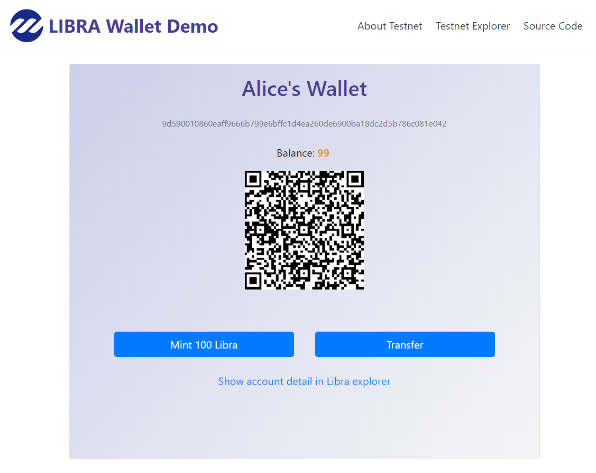

# 如何用190行代码写一个Libra钱包
Libra是Facebook推出的一种全球数字货币。本文详解如何用190行的html+javascript代码写一个简单的Libra网页钱包。下图是该钱包的网页截图：


该网页钱包的页面使用经典的bootstrap+jquery构建，钱包相关的逻辑通过调用MoveonLibra的OpenAPI接口实现。钱包的在线访问地址是[https://www.moveonlibra.com/wallet.html](https://www.moveonlibra.com/wallet.html)

## 1. 创建钱包
每次页面加载完成，首先判断钱包是否存在。如果不存在则创建钱包，代码如下：
```javascript
    $(document).ready(function () {
      init_wallet_and_account();
    });
    async function init_wallet_and_account() {
      if (!localStorage.getItem('wallet')) {
        $('#createWalletModal').modal()
      }else{
          ...
      }
    }
```
本地钱包是存在浏览器的localStorage里的。如果找不到钱包，则弹出一个bootstrap模态对话框，提示用户输入她的钱包的名称：
```html
  <div class="modal fade" id="createWalletModal" tabindex="-1" role="dialog">
      ...
        <div class="modal-body">
          <p>This is your first time to use this libra wallet app. You need to create a wallet of yourself first:</p>
          <input id="wallet_name" type="text" class="form-control" autofocus="true"
            placeholder="Please input the name of wallet">
        </div>
        <div class="modal-footer">
          <button type="button" class="btn btn-primary" onclick="clickCreateWallet()">Create</button>
        </div>
  </div>
```
当用户输入了钱包的名称并点击"Create"按钮以后，调用"clickCreateWallet"方法创建钱包。
```javascript
async function clickCreateWallet() {
      $('#createWalletModal').modal('hide');
      var name = $("#wallet_name").val()
      $('#wallet_name_tag').html(name)
      $("#wait_tx").css('visibility','visible')
      wallet = await call_api("/v1/wallets", { "name": name }, 'POST')
      localStorage.setItem('wallet', JSON.stringify(wallet))
      account = await call_api("/v1/wallets/" + wallet.wallet_id + "/accounts", {}, 'POST')
      localStorage.setItem('account', JSON.stringify(account))
      $("#wait_tx").css('visibility','hidden')
    }
```
上面这段代码的工作流程如下：

* 先关闭创建钱包的模态对话框
* 获得用户输入的钱包名字，并在页面上显示
* 显示一个等待中的图标，等待钱包创建完成
* 调用MoveOnLibra的API创建钱包，接口地址"/v1/wallets"
* 当钱包创建成功，存储到本地的localStorage
* 调用MoveOnLibra的API创建账户，接口地址"/v1/wallets/<wallet_id>/accounts"
* 当账户创建成功，存储到本地的localStorage
* 取消等待中的图标的显示

该钱包兼容官方rust实现的钱包。一个钱包可以有多个子账户，通过确定性的key推导创建，采用官方实现的算法，类似但不同于BIP32。

## 2. 用Promise封装MoveOnLibra的API接口
Javascript的ajax调用默认是异步的，但是钱包的业务逻辑中需要以同步的方式编写，所以我们封装了Jquery的ajax调用，返回一个Promise，从而可以用async/await的方式编写代码。比如创建钱包的代码：
```javascript
    wallet = await call_api("/v1/wallets", { "name": name }, 'POST')
    localStorage.setItem('wallet', JSON.stringify(wallet))
    account = await call_api("/v1/wallets/" + wallet.wallet_id + "/accounts", {}, 'POST')
```
其中，必须等待钱包创建完成，才能在该钱包下面创建账户。`call_api`的实现如下：
```javascript
    function call_api(url, data, method = "GET") {
      const appkey = "...";
      const host = "https://apitest.moveonLibra.com";
      return new Promise(function (resolve, reject) {
        jQuery.ajax({
          url: host + url,
          headers: { "Authorization": appkey },
          data: data, method: method
        })
          .done(function (data) {resolve(data)})
          .fail(function (jqXHR, textStatus, error) {reject(error)})
      })
    }
```
关于async/await的技术原理，可以参考[这篇文章](https://www.freecodecamp.org/news/javascript-from-callbacks-to-async-await-1cc090ddad99/)。

### 关于API接口：文档
完整的MoveOnLibra的接口文档在[这里](https://www.moveonlibra.com/apidoc.html)，上面用到的两个API的文档链接为：[创建钱包](https://www.moveonlibra.com/apidoc.html#operation/create_wallet)和[创建账户](https://www.moveonlibra.com/apidoc.html#operation/create_accounts)。

### 关于API接口：授权
访问MoveOnLibra的钱包接口需要授权：在http请求头上带"Authorization:appkey"。其中的appkey是需要在[这里注册](https://www.moveonlibra.com/users/sign_up)后获得。演示代码中则使用了一个预先创建的appkey，但是任何得到了该appkey的人都可以操作你的钱包，所以该代码仅仅用于演示。


## 3. 显示钱包和账户
如果用户已经拥有了钱包，那么直接加载和显示该钱包：
```javascript
        wallet = JSON.parse(localStorage.getItem('wallet'))
        account = JSON.parse(localStorage.getItem('account'))
        show_wallet()
        refreshBalance()
```
其中，`show_wallet`的代码如下：
```javascript
    function show_wallet(){
      $('#wallet_name_tag').html(wallet.name)
      $('#address_tag').html(account.address)
      var qrcode = new QRCode("qrcode", {
        text: account.address, width: 180, height: 180,
      });
    }
```
上面的代码用于显示钱包名称，账号的地址，以及显示地址的二维码格式。

刷新余额`refreshBalance`的代码如下：
```javascript
    async function refreshBalance(){
      ret = await call_api("/v1/address/balance/"+account.address, {});
      $('#balance').html(ret.balance/1000000)
    }
```
每次钱包加载的时候，都从链上同步余额数据。

    注意：API接口返回的所有涉及到Libra的金额数字，单位都是`micro_libra`，如果要显示为`libra`，则需要除以1000000。

## 4. 造币
本钱包连接到Libra的测试网络，支持造币。当一个账户新建立的时候，账户里的libra余额为零。为了方便测试，我们可以通过造币功能给该账户充一些币。
```javascript
    async function clickMint() {
      data = {
        "number_of_micro_libra": 100*1000000,
        "receiver_account_address": account.address
      }
      $("#wait_tx").css('visibility','visible')
      tx = await call_api("/v1/transactions/mint", data, 'POST');
      $("#wait_tx").css('visibility','hidden')
      if(tx.success){
        $('#balance').html(100 + parseFloat($('#balance').html()))
      }else{
        alert("Transaction Error:"+tx.transaction_info.major_status)
      }
    }
```
上面的代码比较简单，调用"/v1/transactions/mint"接口造币，默认数量是100个`libra`，完成后更新账户的余额。

## 5. 转账
转账功能的逻辑和造币类似，只是需要提供收款方和收款数量。当用户要转账的时候，弹出一个bootstrap的模态对话框，让其提供收款方和转账数量：
```html
  <div class="modal fade" id="transferModal" tabindex="-1" role="dialog">
      ...
        <div class="modal-body">
          <input id="receiver_address" type="text" class="form-control mb-3" autofocus="true"
            placeholder="Receiver Address in hex64 format">
          <input id="transfer_amount" type="number" class="form-control" placeholder="Number of coin">
        </div>
        <div class="modal-footer">
          <button type="button" class="btn btn-primary" onclick="clickTransfer()">Transfer</button>
        </div>
      </div>
    </div>
  </div>
```
当用户点击"Transfer"按钮确定转账的时候，执行下面的js代码：
```javascript
    async function clickTransfer(receiver, micro_libra) {
      var transfer_amount = parseInt($("#transfer_amount").val())
      data = {
        "number_of_micro_libra": transfer_amount * 1000000,
        "receiver_account_address": $("#receiver_address").val(),
        "sender_account_address": account.address,
        "wallet_id": wallet.wallet_id,
      }
      $('#transferModal').modal('hide');
      $("#wait_tx").css('visibility','visible')
      tx = await call_api("/v1/transactions/transfer", data, 'POST')
      $("#wait_tx").css('visibility','hidden')
      if(tx.success){
        $('#balance').html(parseFloat($('#balance').html())-transfer_amount)
      }else{
        alert("Transaction Error:"+tx.transaction_info.major_status)
      }
    }
```
具体的逻辑和造币类似，转账成功后更新账户余额。由于转账的时候，需要对事务进行签名，而签名的key保存在钱包里，所以转账需要四个参数，除了常规的三个参数：

* `sender_account_address`，付款方地址
* `receiver_account_address`， 收款方地址
* `number_of_micro_libra`，转账数量

还需要一个额外的参数：

* `wallet_id`，用于签名的钱包的id。付款方必须是该钱包的子账户。


## 6. 显示账户收支明细
通过查询账户地址发送和收到的事件，就可以知道该账户的收支情况。比如：

* 查看最新的付款情况，通过[查询最新发送的事件](https://www.moveonlibra.com/apidoc.html#operation/get_account_events_latest_sent)可以获得。
* 查看最新的收款情况，通过[查询最新收到的事件](https://www.moveonlibra.com/apidoc.html#operation/get_account_events_latest_received)可以获得。

通过查询事务`Transaction`也可以得到收支情况，但是不准确。主要有两种例外情况：

1. 有些区块链上的事务并不是转账类型的事务，比如各类智能合约
2. 有些转账事务提交到了区块链上，但是执行失败

所以Libra采用事件来记录实际发生的收支情况。

由于已经有很多的Libra区块链浏览器可以查看账户的明细收支情况，所以一个捷径是直接链接到区块链浏览器上查看账户收支明细。代码如下：
```javascript
<a id="explorer" href="https://explorer.moveonlibra.com/" target="_blank">Show account detail in Libra explorer</a>
    var url = $('#explorer').attr("href") + "accounts/" + account.address
    $('#explorer').attr("href", url);
```

## 7. 总结
本文演示了用很少的代码就可以实现一个Libra的钱包。源代码在[这里](https://github.com/MoveOnLibra/libra-wallet-demo-javascript/blob/master/wallet190.html)。这是一个191行的html文件，单独就可以运行。你可以下载到本地然后用chrome或者firefox打开。由于IE/Edge/Safari浏览器不支持在本地文件中访问localStorage，所以只能在网上运行。
在线访问点击[这里](https://www.moveonlibra.com/wallet.html)。